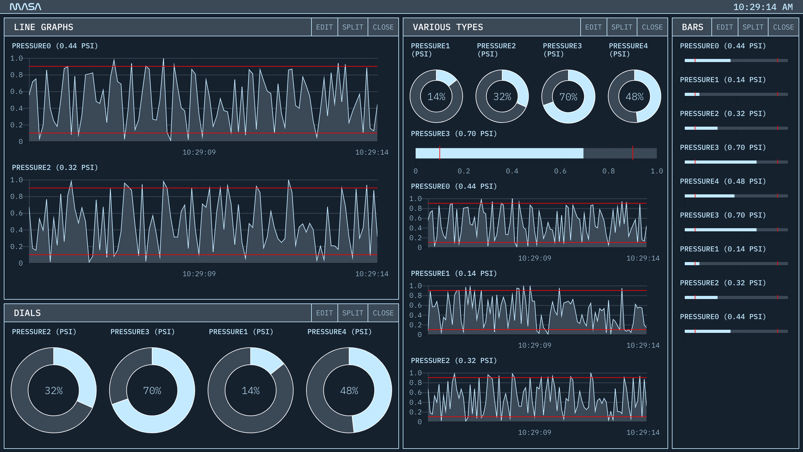

# MASA Dashboard
> Monitor avionics data in real time

This service broadcasts real time avionics data from a server - probably an x86 system connected to engine controller telemetry - and displays the information on a flexible dashboard with customizable panels and graphs. It was built to allow more people to monitor MASA's hotfire tests.

